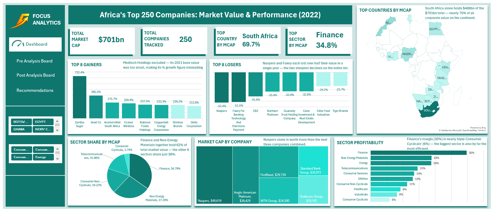

# Africa Top 250 Companies Market Analysis (2022)

## Overview

This project analyses Africa's top 250 companies by market capitalisation for the year 2022, using Microsoft Excel. The analysis covers market value concentration across countries and sectors, profitability by sector, and year over year growth and decline between 2021 and 2022. The goal was to move beyond a simple company ranking and understand the actual structure behind Africa's largest businesses.

Built as part of the Vephla University Data Analytics Programme (VEPH/50B/DA079).

## Dashboard Preview



## Tools Used

- Microsoft Excel
- Pivot Tables
- Slicers (Country, Sector)
- Calculated Fields (Net Margin %, % Growth)
- Filled Map Chart
- Bar, Pie, Donut, and Treemap Charts
- Conditional Formatting

## Key Findings

| Metric | Result |
|---|---|
| Total market cap (2022) | $701bn |
| Companies tracked | 250 |
| Countries covered | 16 |
| Sectors covered | 11 |
| Top country by market cap | South Africa, $488bn (69.7%) |
| Top sector by market cap | Finance, 34.8% |
| Top company by market cap | Naspers, $49.6bn |
| Most profitable sector | Finance, 30% average net margin |
| Companies that grew (2021 to 2022) | 180 of 242 (74%) |
| New entrants (2022) | 39 |

## Performance Summary Tables

### Top 5 Gainers (2021 to 2022)

| Company | % Growth |
|---|---|
| Zambia Sugar | 732% |
| Seed Co | 395% |
| Arcelormittal South Africa | 276% |
| Econet Wireless | 259% |
| National Foods Holdings | 238% |

*Medtech Holdings excluded. Its 2021 base value was too small, making its % growth figure misleading.*

### Top 5 Decliners (2021 to 2022)

| Company | % Change |
|---|---|
| Naspers | -52% |
| Fawry for Banking Technology and Electronic Payment | -52% |
| CBZ | -42% |
| Northam Platinum | -33% |
| Guaranty Trust Holding Company | -33% |

### Sector Share by Market Cap

| Sector | Share |
|---|---|
| Finance | 34.8% |
| Non-Energy Materials | 27.3% |
| Consumer Non-Cyclicals | 18.2% |
| Telecommunications | 16.0% |
| Consumer Cyclicals | 3.7% |

### Sector Profitability (Average Net Margin)

| Sector | Net Margin |
|---|---|
| Finance | 30% |
| Non-Energy Materials | 19% |
| Energy | 19% |
| Telecommunications | 15% |
| Consumer Services | 14% |
| Utilities | 13% |
| Consumer Non-Cyclicals | 11% |
| Healthcare | 9% |
| Industrials | 8% |
| Consumer Cyclicals | 6% |

## Repository Files

| File | Description |
|---|---|
| `Africa_Top_250_Companies_2022.xlsx` | Main deliverable with cleaned data, pivot tables, slicers, and dashboard |
| `Technical_Report.docx` | Full technical report following the Vephla University template |
| `dashboard.png` | Clean screenshot of the full dashboard with no slicer selected |
| `README.md` | This file |

## Project Structure

```
africa-top-250-companies-market-analysis-2022/
│
├── Africa_Top_250_Companies_2022.xlsx
├── Technical_Report.docx
├── dashboard.png
└── README.md
```

## Key Insights

- South Africa alone accounts for 69.7% of total market cap across the 16 countries covered, nearly seven times the next largest country.
- Finance and Non-Energy Materials together hold 62% of total market value, while the remaining 9 sectors share just 38%.
- Naspers, the single largest company, is worth more than the next three companies combined.
- Finance leads on both size and profitability, with a 30% average net margin, nearly triple Consumer Cyclicals at 6%.
- 74% of companies grew their market cap from 2021 to 2022, but the two steepest declines belonged to Naspers and Fawry, two of the most recognisable names on the list.
- The strongest growth came from mid-sized, sector-specific companies rather than the continent's largest names.

## Recommendations Summary

- Diversify analysis and investment focus beyond South Africa to avoid concentrated risk.
- Prioritise Finance and Non-Energy Materials for stability, while looking beyond the top 10 companies for growth opportunities.
- Track year over year performance trends rather than relying on static company rankings.
- Investigate high growth outliers before treating them as a repeatable pattern.
- Use net margin, not market cap alone, when screening sectors for efficiency.
- Expand data coverage beyond the top 250 before drawing continent wide conclusions.

## Author

**George Nzubechi Chibuikem**
Student ID: VEPH/50B/DA079
Vephla University Data Analytics Programme
2022 Dataset Analysis
